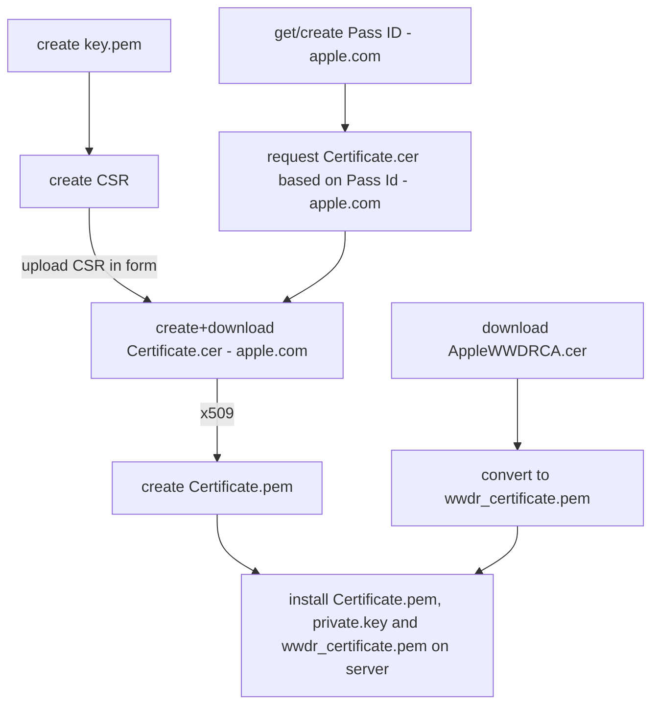

# edutap.wallet_apple

This package provides a Python API and web server endpoints to create and update official Apple Wallet Passes.

This package provides

- [x] an API and models for the creation of apple pass files (.pkpass)
- [x] infrastructure to sign pass files with an Apples certificate.
- [ ] Initial pass delivery with save link creation and a matching FastAPI endpoint.
- [ ] Support for the update process of passes 
    - using apple push notifications and 
    - providing an update information endpoint (FastAPI)
    - providing an pass delivery endpoint for fetching updated passes.
- [ ] abstract/pluggable data providers are defined to fetch data on pass-delivery or -update.


## Installation

Prerequisites:

- Python >= 3.10
- SWIG (needed by the M2crypto Python library), for Debian/Ubuntu based system sue:
  
  ```bash
  sudo apt-get install swig
  ```

Example installation for development via Pip, it is recommended to use a Python Virtual Environment:

```bash
python -m venv .venv
source .venv/bin/activate
pip install -e .[test]
```

### OSX

If you have problems installing M2Crypto on an Apple Silicon, you need to use `LDFALGS` and `CFLAGS`:

```console
LDFLAGS="-L$(brew --prefix openssl)/lib" CFLAGS="-I$(brew --prefix openssl)/include" SWIG_FEATURES="-I$(brew --prefix openssl)/include" pip install m2crypto
```


## Running the Unittests

The unit tests can be run without the cert files:

```shell
pytest -m "not integration"
```

## Installation of Certificates

PKPASS is a file format, used for storage and exchange of digital passes, developed by Apple for its Wallet application (Formerly known as PassBook until iOS 9)

For signing the .pkpass files we need certificate and key files that need to be created. 
Please follow exactly the steps described below. 
You need an Apple developer account to obtain the certificate for the pass identifier.

To run integration tests a private key, a certificate and the Apple root certificate needs to be prepared.

This is the overall process to get the necessary certificates for issuing passes:



### Preparing Private Key and Certificate Signing Request

> **_NOTE:_**  This is only necessary when you create a new certificate, if you already have certificates in your account you can download them.

1. Create your own private key
   ```shell
   openssl genrsa -out private.key 2048
   ```

2. Create a certificate signing request (CSR) with the private key

   Name and email do not necessarily have to match with the account data of your apple developer account.
   
   ```shell
   openssl req -new -key private.key -out request.csr -subj="/emailAddress=[your email addr],CN=[your full name],C=[your country ISO code]"
   ```

### Get a Pass Type ID and Certificate from Apple

You need a developer account at Apple to get a pass type ID and a certificate for signing passes. 
You can get a free developer account at [developer.apple.com](https://developer.apple.com/programs/)

To get the certificate:

* Visit the iOS Provisioning [Portal -> Pass Type IDs -> New Pass Type ID](https://developer.apple.com/account/resources/identifiers/list/passTypeId)
    - either create a new pass type ID by clicking the blue (+) icon on top of the menu
    - or select one of the existing pass type ID's

* In the screen labelled `Edit your Identifier Configuration` either
    - select an existing certificate and hit the `Download` button
    - or hit `Create Certificate` on the bottom of the page (there you need the above mentioned `request.cer`) and download it

* Convert the `certificate.cer` (X509 format) to a `certificate.pem` file by calling

  ```shell
  openssl x509 -inform der -in pass.cer -out certificate.pem
  ```

### Apple Worldwide Developer Relations (WWDR) root certificate

The certificate is usually preinstalled in your OS, but either in case of expiration or if you want to run the integration tests, the most recent can be downloaded at
[Apple Certification Authority AppleWWDRCA.cer download](https://developer.apple.com/certificationauthority/AppleWWDRCA.cer)

```shell
curl https://www.apple.com/certificateauthority/AppleWWDRCAG4.cer -o AppleWWDRCA.cer
```

For more on expiration read [Apple Support - Expiration](https://developer.apple.com/support/certificates/expiration/).
There is also an [overview of downloadable Apple certificates](https://www.apple.com/certificateauthority/)

Once downloaded, convert the root certificate into a pem file"

```shell
openssl x509 -inform der -in AppleWWDRCA.cer -out wwdr_certificate.pem
```

Further reading: [Building a Pass - documentation at Apple](https://developer.apple.com/documentation/walletpasses/building_a_pass)

To check the expiration date of the certificate use:

```shell
openssl x509 -enddate -noout -in wwdr_certificate.pem
```

In case the OS provided certificate is expired, copy the certificate to the OS certificates folder (this depends on the system).

## Running the Integration Tests

⚠️ **Attention:**
 To run integration tests, the above mentioned files (`certificate.pem`, `private.key` and `wwdr_certificate.pem`) have to be located at `tests/data/certs/private`. 
Create the folder if it is missing, do *never* add/commit them it to Git!

```shell
pytest -m integration
```

the test "test_passbook_creation_integration" will create a passbook file and display it with the passbook viewer. 

The test case `test_passbook_creation_integration` will create some pkpass-files. 
Those are located under tests/data/genererated_passes.
Displaying the pass works only under OSX since the passbook viewer is part of it.

# Notification

TODO

## Create a certificate for push notifications

TODO

## Further readings

- [apple doc for updating passes](https://developer.apple.com/documentation/walletpasses/adding_a_web_service_to_update_passes)

- [passninja docs](https://www.passninja.com/tutorials/apple-platform/how-does-pass-updating-work-on-apple-wallet)


## Documentation

TODO

Read the [complete `edutap.wallet_apple` documentation](https://docs.edutap.eu/packages/edutap_wallet_apple/index.html) to get started.

## Credits

This project was initiated and initially financed by [LMU München](https://www.lmu.de).
Further development was financially supported by [Hochschule München](https://hm.edu/).

Contributors:

- Alexander Loechel (LMU)
- Philipp Auersperg-Castell (BlueDynamics Alliance)
- Jens Klein (BlueDynamics Alliance)

## Source Code

The sources are in a GIT DVCS with its main branches at the [GitHub `edutap-eu` `edutap.wallet_apple` repository](https://github.com/edutap-eu/edutap.wallet_apple) .

We'd be happy to see many issue reports, forks and pull requests to make the package even better.

## License

The code is copyrighted 2023 by eduTAP - EUGLOH Working Package - Campus Life and contributors.

It is licensed under the [EUROPEAN UNION PUBLIC LICENCE v. 1.2](https://opensource.org/license/eupl-1-2/), a free and OpenSource software license.
