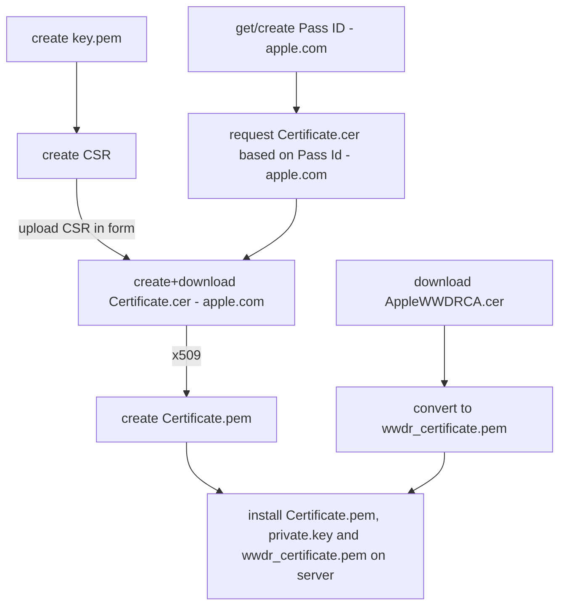

# edutap.apple_wallet


## Install and Working

If you have problems installing M2Crypto on an Apple Silicon, you need to use `LDFALGS` and `CFLAGS`:

```console
LDFLAGS="-L$(brew --prefix openssl)/lib" CFLAGS="-I$(brew --prefix openssl)/include" SWIG_FEATURES="-I$(brew --prefix openssl)/include" pip install m2crypto
```


## Credits

This project is based on the work of https://github.com/devartis/passbook

## Installation Cert stuff

To run the passbook server you need a certificate and a private key. The certificate is used to sign the passbook files and the private key is used to sign the push notifications. The certificate and the private key are stored in the config file of the passbook server.

this is the overall process to get the necessary certificates for issuing passes



### prepare key and CSR for requesting a certificate from apple

- create your own private key
```shell
$ openssl genrsa -out private.key 2048
```

- create a certificate signing request (CSR) with the private key
```shell
$ openssl req -new -key private.key -out request.csr -subj="/emailAddress=[your email addr],CN=[your full name],C=[your country ISO code]"
```


### Get a Pass Type Id and certificate from Apple

you need a developer account at apple to get a pass type id and a certificate for signing your passes. you can get a free developer account at [developer.apple.com](https://developer.apple.com/programs/)

* Visit the iOS Provisioning [Portal -> Pass Type IDs -> New Pass Type ID](https://developer.apple.com/account/resources/identifiers/list/passTypeId)
* Select pass type id -> Configure (Follow steps and download generated pass.cer file)
* Use Keychain tool to export a Certificates.cer  file (need Apple Root Certificate installed)
* Convert the certificate.cer (X509 format) to a certificate.pem file by calling

```shell
    $ openssl x509 -inform der -in pass.cer -out certificate.pem
```

### Apple Worldwide Developer Relations (WWDR) root certificate

the certificate is preinstalled, but in case of expiration it can be downloaded from
[https://developer.apple.com/certificationauthority/AppleWWDRCA.cer](apple authority)

see [https://developer.apple.com/support/certificates/expiration/](apple support)

```shell
curl https://www.apple.com/certificateauthority/AppleWWDRCAG4.cer -o AppleWWDRCA.cer
```

an overview of downloadable apple certs:

https://www.apple.com/certificateauthority/

convert it to a pem file

```shell
openssl x509 -inform der -in AppleWWDRCA.cer -out wwdr_certificate.pem
```
then copy it into the 'certs' folder of the passbook server


see [documentation @ apple](https://developer.apple.com/documentation/walletpasses/building_a_pass)

check expiration date of certificate

```shell
openssl x509 -enddate -noout -in file.pem
```

### Install certificate and private key for integration tests

copy the `certificate.pem`, `private.key` and `wwdr_certificate.pem` to the 'certs' directory your server.

## run the integration tests

```shell
pytest -m integration
```

the test "test_passbook_creation_integration" will create a passbook file and display it with the passbook viewer. This test runs just under OSX.

# Notification

https://developer.apple.com/documentation/walletpasses/adding_a_web_service_to_update_passes

## Create a certificate for push notifications
