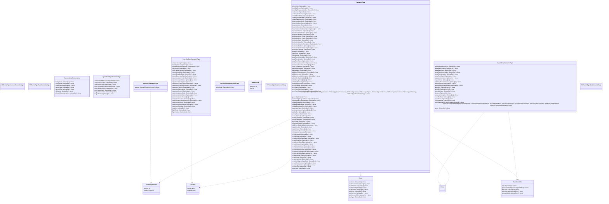

```mermaid
classDiagram

    class EventDateInfo {
        date: Optional[str] = None
        ignoreTimeComponents: Optional[bool] = None
        timeZone: Optional[str] = None
        unannounced: Optional[bool] = None
        undetermined: Optional[bool] = None
    }

    class PKTransitTypeGenericSemanticTags {
    }

    class PKTransitTypeTrainSemanticTags {
    }

    class PersonNameComponents {
        familyName: Optional[str] = None
        givenName: Optional[str] = None
        middleName: Optional[str] = None
        namePrefix: Optional[str] = None
        nameSuffix: Optional[str] = None
        nickname: Optional[str] = None
        phoneticRepresentation: Optional[str] = None
    }

    class Seat {
        seatAisle: Optional[str] = None
        seatDescription: Optional[str] = None
        seatIdentifier: Optional[str] = None
        seatLevel: Optional[str] = None
        seatNumber: Optional[str] = None
        seatRow: Optional[str] = None
        seatSection: Optional[str] = None
        seatSectionColor: Optional[str] = None
        seatType: Optional[str] = None
    }

    class CurrencyAmount {
        amount: str
        currencyCode: str
    }

    class SportEventTypeSemanticTags {
        awayTeamAbbreviation: Optional[str] = None
        awayTeamLocation: Optional[str] = None
        awayTeamName: Optional[str] = None
        homeTeamAbbreviation: Optional[str] = None
        homeTeamLocation: Optional[str] = None
        homeTeamName: Optional[str] = None
        leagueAbbreviation: Optional[str] = None
        leagueName: Optional[str] = None
    }

    class BoardingPassSemanticTags {
        airlineCode: Optional[str] = None
        boardingGroup: Optional[str] = None
        boardingSequenceNumber: Optional[str] = None
        carNumber: Optional[str] = None
        confirmationNumber: Optional[str] = None
        currentArrivalDate: Optional[str] = None
        currentBoardingDate: Optional[str] = None
        currentDepartureDate: Optional[str] = None
        departureAirportCode: Optional[str] = None
        departureAirportName: Optional[str] = None
        departureGate: Optional[str] = None
        departureLocation: Optional[Location] = None
        departureLocationDescription: Optional[str] = None
        departurePlatform: Optional[str] = None
        departureStationName: Optional[str] = None
        departureTerminal: Optional[str] = None
        destinationAirportCode: Optional[str] = None
        destinationAirportName: Optional[str] = None
        destinationGate: Optional[str] = None
        destinationLocation: Optional[str] = None
        destinationLocationDescription: Optional[str] = None
        destinationPlatform: Optional[str] = None
        destinationStationName: Optional[str] = None
        destinationTerminal: Optional[str] = None
        duration: Optional[int] = None
        flightCode: Optional[str] = None
        flightNumber: Optional[str] = None
    }

    class StoreCardSemanticTags {
        balance: Optional[CurrencyAmount] = None
    }

    class Location {
        latitude: float
        longitude: float
    }

    class PKTransitTypeAirSemanticTags {
        airlineCode: Optional[str] = None
    }

    class WifiNetwork {
        password: str
        ssid: str
    }

    class PKTransitTypeBusSemanticTags {
    }

    class SemanticTags {
        airlineCode: Optional[str] = None
        boardingGroup: Optional[str] = None
        boardingSequenceNumber: Optional[str] = None
        carNumber: Optional[str] = None
        confirmationNumber: Optional[str] = None
        currentArrivalDate: Optional[str] = None
        currentBoardingDate: Optional[str] = None
        currentDepartureDate: Optional[str] = None
        departureAirportCode: Optional[str] = None
        departureAirportName: Optional[str] = None
        departureGate: Optional[str] = None
        departureLocation: Optional[Location] = None
        departureLocationDescription: Optional[str] = None
        departurePlatform: Optional[str] = None
        departureStationName: Optional[str] = None
        departureTerminal: Optional[str] = None
        destinationAirportCode: Optional[str] = None
        destinationAirportName: Optional[str] = None
        destinationGate: Optional[str] = None
        destinationLocation: Optional[str] = None
        destinationLocationDescription: Optional[str] = None
        destinationPlatform: Optional[str] = None
        destinationStationName: Optional[str] = None
        destinationTerminal: Optional[str] = None
        duration: Optional[int] = None
        flightCode: Optional[str] = None
        flightNumber: Optional[str] = None
        awayTeamAbbreviation: Optional[str] = None
        awayTeamLocation: Optional[str] = None
        awayTeamName: Optional[str] = None
        homeTeamAbbreviation: Optional[str] = None
        homeTeamLocation: Optional[str] = None
        homeTeamName: Optional[str] = None
        leagueAbbreviation: Optional[str] = None
        leagueName: Optional[str] = None
        additionalTicketAttributes: Optional[str] = None
        admissionLevel: Optional[str] = None
        admissionLevelAbbreviation: Optional[str] = None
        albumIDs: Optional[List[str]] = None
        artistIDs: Optional[List[str]] = None
        attendeeName: Optional[str] = None
        entranceDescription: Optional[str] = None
        eventEndDate: Optional[str] = None
        eventName: Optional[str] = None
        eventStartDate: Optional[str] = None
        eventStartDateInfo: Optional[EventDateInfo] = None
        eventType: Optional[Literal['PKEventTypeGeneric', 'PKEventTypeLivePerformance', 'PKEventTypeMovie', 'PKEventTypeSports', 'PKEventTypeConference', 'PKEventTypeConvention', 'PKEventTypeWorkshop', 'PKEventTypeSocialGathering']] = None
        genre: Optional[str] = None
        membershipProgramName: Optional[str] = None
        membershipProgramNumber: Optional[str] = None
        originalArrivalDate: Optional[str] = None
        originalBoardingDate: Optional[str] = None
        originalDepartureDate: Optional[str] = None
        passengerName: Optional[str] = None
        performerNames: Optional[List[str]] = None
        playlistIDs: Optional[str] = None
        priorityStatus: Optional[str] = None
        seats: Optional[List[Seat]] = None
        securityScreening: Optional[str] = None
        silenceRequested: Optional[bool] = None
        sportName: Optional[str] = None
        tailgatingAllowed: Optional[bool] = None
        totalPrice: Optional[CurrencyAmount] = None
        transitProvider: Optional[str] = None
        transitStatus: Optional[str] = None
        transitStatusReason: Optional[str] = None
        vehicleName: Optional[str] = None
        vehicleNumber: Optional[str] = None
        vehicleType: Optional[str] = None
        venueBoxOfficeOpenDate: Optional[str] = None
        venueCloseDate: Optional[str] = None
        venueDoorsOpenDate: Optional[str] = None
        venueEntrance: Optional[str] = None
        venueEntranceDoor: Optional[str] = None
        venueEntranceGate: Optional[str] = None
        venueEntrancePortal: Optional[str] = None
        venueFanZoneOpenDate: Optional[str] = None
        venueGatesOpenDate: Optional[str] = None
        venueLocation: Optional[Location] = None
        venueName: Optional[str] = None
        venueOpenDate: Optional[str] = None
        venueParkingLotsOpenDate: Optional[str] = None
        venuePhoneNumber: Optional[str] = None
        venueRegionName: Optional[str] = None
        venueRoom: Optional[str] = None
        wifiAccess: Optional[str] = None
    }

    class EventTicketSemanticTags {
        awayTeamAbbreviation: Optional[str] = None
        awayTeamLocation: Optional[str] = None
        awayTeamName: Optional[str] = None
        homeTeamAbbreviation: Optional[str] = None
        homeTeamLocation: Optional[str] = None
        homeTeamName: Optional[str] = None
        leagueAbbreviation: Optional[str] = None
        leagueName: Optional[str] = None
        additionalTicketAttributes: Optional[str] = None
        admissionLevel: Optional[str] = None
        admissionLevelAbbreviation: Optional[str] = None
        albumIDs: Optional[List[str]] = None
        artistIDs: Optional[List[str]] = None
        attendeeName: Optional[str] = None
        duration: Optional[int] = None
        entranceDescription: Optional[str] = None
        eventEndDate: Optional[str] = None
        eventName: Optional[str] = None
        eventStartDate: Optional[str] = None
        eventStartDateInfo: Optional[EventDateInfo] = None
        eventType: Optional[Literal['PKEventTypeGeneric', 'PKEventTypeLivePerformance', 'PKEventTypeMovie', 'PKEventTypeSports', 'PKEventTypeConference', 'PKEventTypeConvention', 'PKEventTypeWorkshop', 'PKEventTypeSocialGathering']] = None
        genre: Optional[str] = None
    }

    class PKTransitTypeBoatSemanticTags {
    }

    EventTicketSemanticTags ..> EventDateInfo
    EventTicketSemanticTags ..> Literal
    BoardingPassSemanticTags ..> Location
    StoreCardSemanticTags ..> CurrencyAmount
    SemanticTags ..> Location
    SemanticTags ..> EventDateInfo
    SemanticTags ..> Literal
    SemanticTags ..> Seat
    SemanticTags ..> CurrencyAmount


```